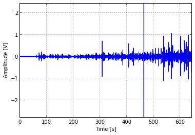
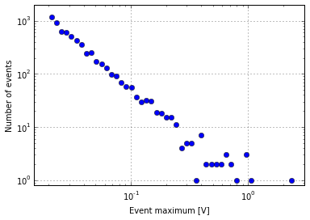

#ae

Python acoustic emission tools.

##Features
* read *.wfs files
* read *.sdcf files
* event extractor
* interactive decimated waveform plotting
* optimized for files bigger than RAM

##[Example](http://nbviewer.ipython.org/github/jove1/ae/blob/master/doc/example.ipynb)
```python
>>> import ae
>>> f = ae.open("M5.wfs")
>>> print f.size
642798592
>>> f.plot()
```

```python
>>> events = f.get_events(0.02)
>>> print events.size
6161
>>> ae.hist(event.maxima)
```


##Install
###Dependencies: 
* [python](http://python.org)
* [scipy](http://scipy.org)
* [matplotlib](http://matplotlib.org)

###Linux:
```
git clone https://github.com/jove1/ae.git
python setup.py install
```

###Windows:
Install [python 2](http://python.org/downloads/windows/).
Get corresponding [numpy](http://www.lfd.uci.edu/~gohlke/pythonlibs/#numpy) and [scipy](http://www.lfd.uci.edu/~gohlke/pythonlibs/#scipy) packages and run:
```
C:\Python27\Scripts\pip.exe install numpy‑....whl
C:\Python27\Scripts\pip.exe install scipy‑....whl
C:\Python27\Scripts\pip.exe install matplotlib
```
Finally, install [ae](https://pypi.python.org/pypi/ae) itself.

